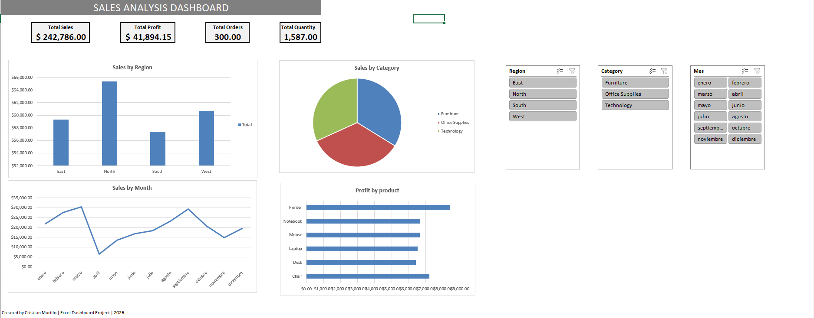

# 📊 Sales Analysis Dashboard

## 📌 Project Overview

This project presents an interactive Sales Analysis Dashboard built in Microsoft Excel.

The dashboard was designed to help analyze sales performance by region, category, product, and month using Pivot Tables, Pivot Charts, KPIs, and Slicers.

---

## 🛠 Tools Used

- Microsoft Excel
- Pivot Tables
- Pivot Charts
- Slicers
- Data Cleaning

---

## 📈 Key Performance Indicators (KPIs)

- Total Sales
- Total Profit
- Total Orders
- Total Quantity

---

## 📊 Dashboard Visualizations

- Sales by Region
- Sales by Category
- Sales by Month
- Profit by Product

---

## 💡 Business Questions Answered

- Which region generated the highest sales?
- Which category generated the highest revenue?
- Which products generated the highest profit?
- How did sales change throughout the year?

---

## 📷 Dashboard Preview


---

## 📁 Project Structure

```text
sales-analysis-excel-dashboard
│
├── sales_analysis_dashboard.xlsx
├── README.md
└── images
    └── dashboard_preview.png
```

---

## 👤 Author

**Cristian Murillo**

Aspiring Data Analyst | Excel | SQL | Python | Tableau
